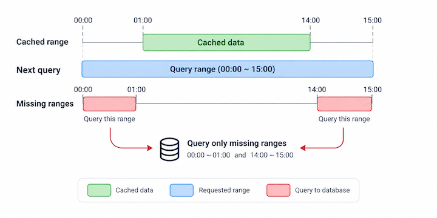

# rangecache

[中文說明 / Chinese version](docs/README.ch.md)


rangecache v0.3 adds support for non-`Instant` naturally ordered range types,
including `LocalDate`, `LocalDateTime`, `Integer`, `Long`, `BigDecimal`, and
`String`. It is under active testing and is not a stable release yet. See the [v0.3 preview branch](https://github.com/LiuWei997/rangecache/tree/preview).

---

rangecache is a Spring Boot cache for ordered range queries. When a new query
overlaps data that has already been checked, it queries only the uncovered
gaps and merges the result with the cached rows.

In the diagram, `[01:00, 14:00]` is already cached. A later request for
`[00:00, 15:00]` queries only `[00:00, 01:00]` and `[14:00, 15:00]`.



## Quick start

Annotate a Spring-managed repository or service method:

```java
@RangeCacheable(
    cacheName = "events",
    rangeProperty = "createdAt",
    uniqueKeyProperty = "id"
)
List<Event> findEvents(
    String accountKey,
    @RangeStart Instant rangeStart,
    @RangeEnd Instant rangeEnd
);
```

The method should return a deterministic `List`. The two range parameters are
closed-closed (`[start, end]`) and must be non-null. Different non-range
arguments represent different logical data series; different ranges for the
same series share coverage.

With the default conventions, `rangeProperty` is `cachedRange` and
`uniqueKeyProperty` is `nonRepeatedKey`. Parameters named `rangeStart` and
`rangeEnd` can omit `@RangeStart` and `@RangeEnd` when Java parameter names are
retained.

## Gap query threshold

`max-delta-queries` controls how many uncovered gaps can be fetched separately:

```yaml
rangecache:
  max-delta-queries: 5
```

- `0` or a missing range with more than the threshold: use one full-range query;
- up to the threshold: query each missing gap and merge it with cached data;
- default: `5`.

The local cache keeps up to 512 logical series by default. This can be changed
with `maximum-series`:

```yaml
rangecache:
  enabled: true
  max-delta-queries: 5
  maximum-series: 512
```

Set `rangecache.enabled=false` to disable the starter.

## Maven coordinates

```xml
<dependency>
  <groupId>io.github.liuwei997</groupId>
  <artifactId>rangecache-spring-boot-starter</artifactId>
  <version>0.3.0-SNAPSHOT</version>
</dependency>
```

The current version is a local snapshot. To use the source directly:

```bash
git clone https://github.com/LiuWei997/rangecache.git
cd rangecache
mvn install
```

Requires Java 17+ and Spring Boot 3+.

## Current limitations

- Range endpoints and the row range property must use the exact same concrete
  naturally comparable type. V0.3 is tested with `Instant`, `LocalDateTime`,
  `LocalDate`, `OffsetDateTime`, `ZonedDateTime`, `Integer`, `Long`,
  `BigDecimal`, and `String`. Other concrete `Comparable` types also work when
  their database ordering matches Java `compareTo`.
- `String` requires a database collation compatible with Java Unicode order.
  Align database/JDBC timezone and fractional-second precision with the Java
  type; rangecache does not convert values.
- The range is one-dimensional and closed-closed.
- Both range endpoints are required; `null` is not an unbounded endpoint.
- The method must return a complete, deterministic `List`.
- The default store is local in-memory LRU; Redis and distributed cache storage
  are not included yet.
- The data should be ordered and append-mostly. Backdated updates or deletes
  require explicit invalidation.

---
🌟 Support this projectIf you like this project, please give it a Star! It helps more people discover the repository and is the best encouragement for open-source creators.
